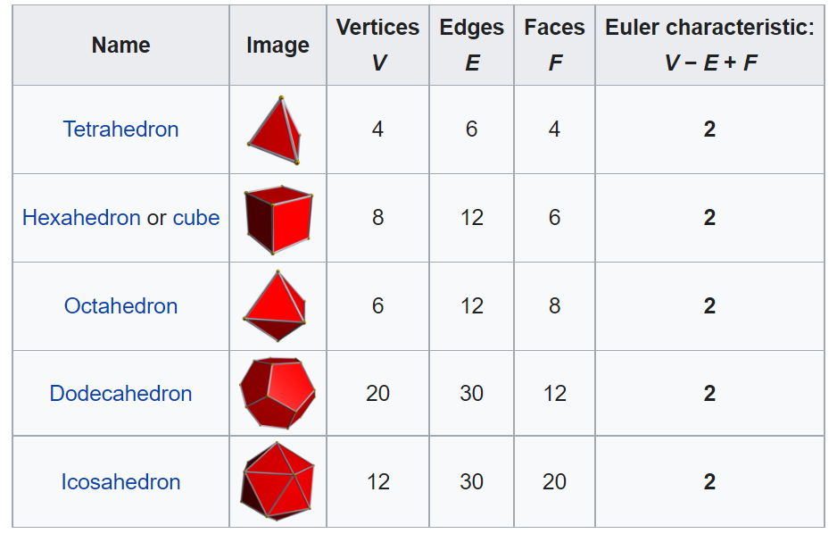
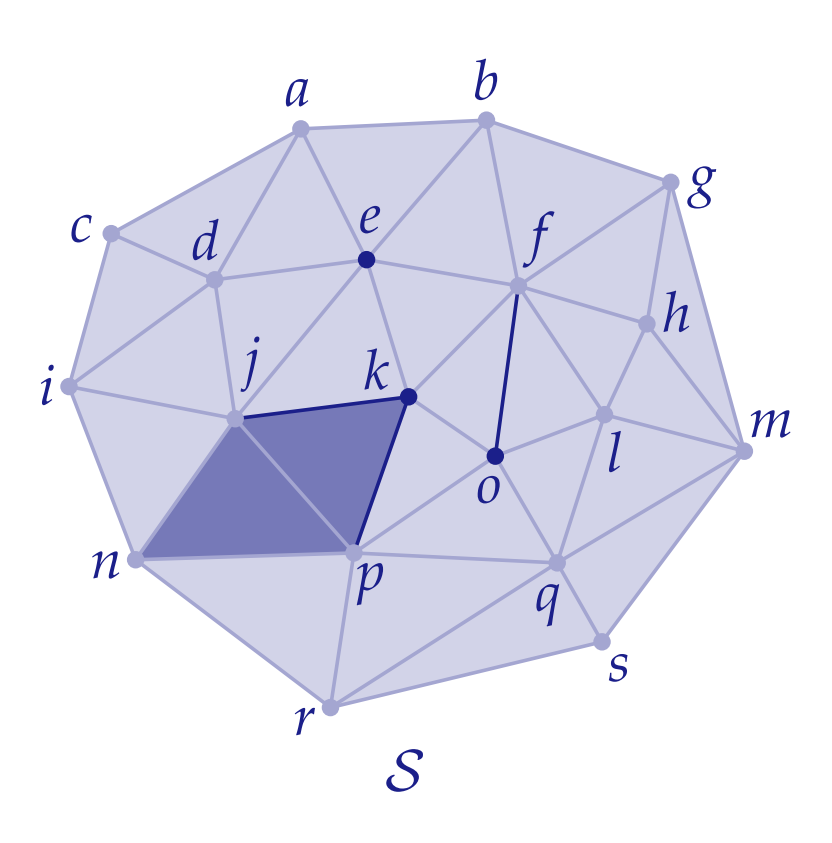
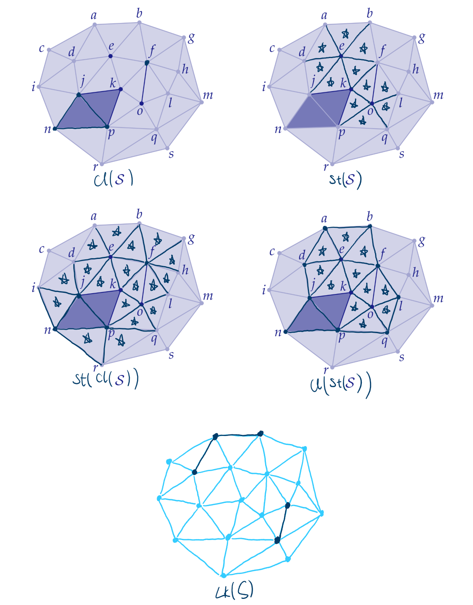
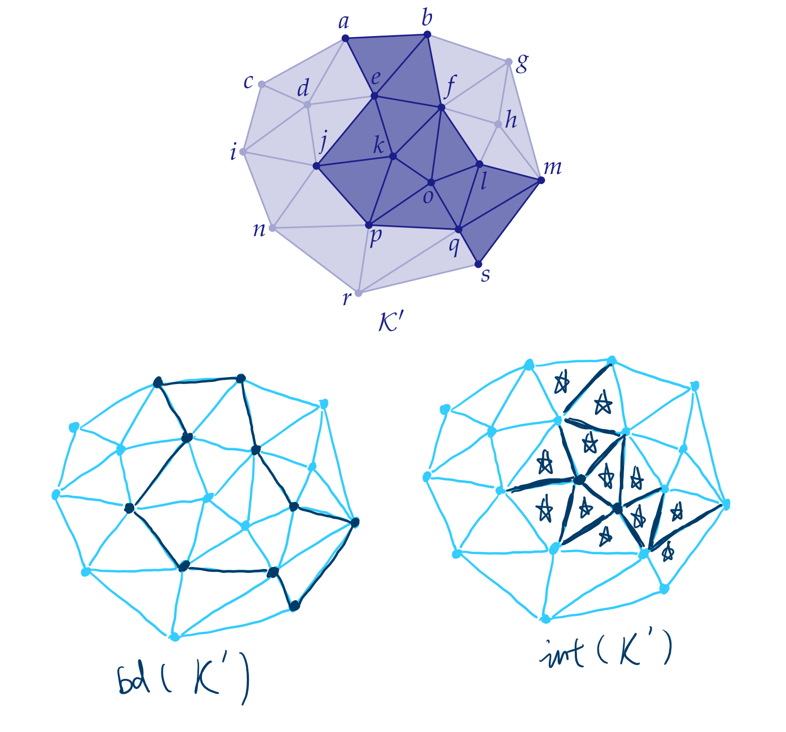
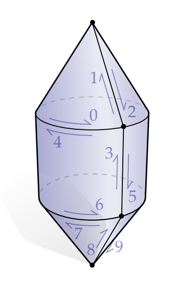
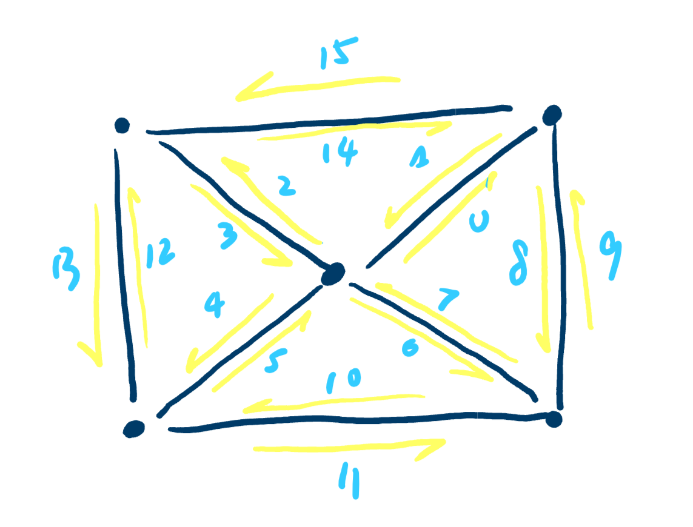
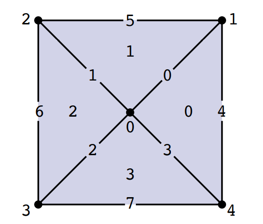

# Written Assignment 0

## EXERCISE 2.1 - Euler’s Polyhedral Formula

The [Euler characteristic](https://en.wikipedia.org/wiki/Euler_characteristic) $\chi=V-E+F$ is a topological invariant.

> Statement 1:
>
> For any polygonal disk, it satisfies $V-E+F=1$
>
> Statement 2:
>
> For any concave polyhedral (polygonal sphere), it satisfies $V-E+F=2$.

Proof of statement 2 with statement 1 given:

**First by removing one face of the polyhedral, we can get a surface (with a hole on it) that is topologically equivalent to the polygonal disk.** In fact, if we choose another one face as the target plane, with the hole stretched out and pulled away, a projected polygonal disk can be obtained and the missing face is now placed externally.

The resulted disk shares the same number of vertices and edges as the original polyhedral but contains 1 less face. So if the statement 1 holds, we can prove that the statement 2 holds.

## EXERCISE 2.2 - Platonic Solids

> In particular, they knew that there are only five genus-zero polyhedra where all faces have the same number of sides, and the same number of faces meet at every vertex. These polyhedra are the Platonic solids: the tetrahedron, icosahedron, octahedron, dodecahedron, and cube.

Here is the proof that this list is exhaustive:

Let $S$ be the number of sides and $K$ be the number of faces sharing the same vertex. Note that $S\geq3$, $K\geq3$, and $S,K\in \mathcal{Z}$.

> $S\geq3$ is intuitive since 2-simplex has 3 vertices.
>
> $K\geq3$ comes from the fact that $K=1$ breaks the connectivity and $K=2$ introduces boundaries.

We have 2 equations with the help of $S$ and $K$
$$FS=2E$$
$$FS=KV$$
Apply these 2 equations into $V-E+F=2$, we get
$$F = \frac{4K}{2S+2K-SK}$$
As $F$ is positive so $2S+2K-SK$ is required to be positive, **and only 5 combinantions of $S$ and $K$ satisfy - (3, 3), (3, 4), (3, 5), (4, 3), and (5, 3).** They are respectively tetrahedron, octahedron, icosahedron, hexahedron (cube), and dodecahedron.

\

## EXERCISE 2.3 - Regular Valence

> The valence of a vertex in a combinatorial surface is the number of edges that contain that vertex. A vertex of a simplicial surface is said to be regular when its valence equals six.
> **Regular valence is important for numerical algorithms.**

> Show that the only (connected, orientable) simplicial surface for which every vertex has regular valence is a torus (g = 1).

Proof:

Based on euler-poincare formula, every simplicial surface has $V-E+F=2-2g$ where $g$ is the number of handles. If every vertex has regular valence, we get
$$6V=2E$$
$$3F=2E$$
So, $V-E+F=0$ and $g=1$, which indicates the simplicial surface is torus.

## EXERCISE 2.4 - Minimum Irregular Valence

> Show that the minimum possible number of irregular valence vertices in a (connected, orientable) simplicial surface $K$ of genus g is given by
> $$m(K)= \begin{cases}4, & g=0 \\ 0, & g=1 \\ 1, & g \geq 2\end{cases}$$

Let $V_r$ be the number of regular vertices, $V_{ir}$ be the number of irregular vertices, and $K$ be the mean valence of the irregular vertices.

We have $6V_r+KV_{ir}=2E=3F$, so the euler-poincare formula becomes
$$(1-\frac{K}{6})V_{ir}=2-2g$$
When $g=0$, we require $3\leq K<6$ so $V_{ir}\geq4$;

When $g=1$, we can have $V_{ir}=0$;

When $g\geq2$, we require $K>6$ but do not constrain $V_{ir}$, hence $V_{ir}$ could be any positive integer.

## EXERCISE 2.5 - Mean Valence (Triangle Mesh)

>Show that the mean valence approaches six as the number of vertices in a (connected, orientable) simplicial surface goes to infinity, and that the ratio of vertices to edges to triangles hence approaches
>$$V:E:F=1:3:2$$

Let $K$ be the mean valence of vertices, we have $KV=2E=3F$ for triangular mesh.

From E-P formula, we have:
$$1-\frac{K}{6}=\frac{2-2g}{V}$$
so when $V$ goes to infinity, mean valence approaches 6.

## EXERCISE 2.6 - Mean Valence (Quad Mesh)

For quad mesh, we have $KV=2E=4F$, so E-P formula becomes
$$1-\frac{K}{4}=\frac{2-2g}{V}$$
so $V:E:Q=1:2:1$ if $V$ goes into infinity.

## EXERCISE 2.7 - Mean Valence (Tetrahedral)

If we assume that $Lk(i)$ of every vertex $i\in V$ is a combinatorial icosahedron, we will have the relationship regardless of boundary vertices:
$$20V=4T$$
It is natrual to have $KV=2E$ and $2F=4T$. Apply them to $V-E+F-T=c$, we get:
$$6-\frac{K}{2}=\frac{c}{V}$$
So when $V$ goes to infinity, $K$ approaches 12 and $V:E:F:T=1:6:10:5$.

## EXERCISE 2.8 - Star, Closure, and Link

If S is defined as:

{width=60%}\

Star, Closure, and Link of S:

{width=60%}\

## EXERCISE 2.9 - Boundary and Interior

{width=60%}\

## EXERCISE 2.10 - Surface as Permutation

{width=30%}\

Twin:

| h         | 0    | 1    | 2    | 3    | 4    | 5    | 6    | 7    | 8    | 9    |
| --------- | ---- | ---- | ---- | ---- | ---- | ---- | ---- | ---- | ---- | ---- |
| $\eta(h)$ | 4    | 2    | 1    | 5    | 0    | 3    | 7    | 6    | 9    | 8    |

Next:

| h         | 0    | 1    | 2    | 3    | 4    | 5    | 6    | 7    | 8    | 9    |
| --------- | ---- | ---- | ---- | ---- | ---- | ---- | ---- | ---- | ---- | ---- |
| $\rho(h)$ | 1    | 2    | 0    | 4    | 5    | 6    | 3    | 9    | 7    | 8    |

Note the orbit of $\eta$ (edges), $\rho$ (faces), and $\rho\circ\eta$ (vertices).

## EXERCISE 2.11 - Permutation as Surface

| h         | 0    | 1    | 2    | 3    | 4    | 5    | 6    | 7    | 8    | 9    | 10   | 11   | 12   | 13   | 14   | 15   |
| --------- | ---- | ---- | ---- | ---- | ---- | ---- | ---- | ---- | ---- | ---- | ---- | ---- | ---- | ---- | ---- | ---- |
| $\rho(h)$ | 8    | 2    | 14   | 4    | 12   | 6    | 10   | 0    | 7    | 15   | 5    | 9    | 3    | 11   | 1    | 13   |

vertices: {0, 2, 4, 6}, {1, 8, 15}, {3, 14, 13}, {5, 12, 11}, {7, 10, 9}

faces: {0, 8, 7}, {1, 2, 14}, {3, 4, 12}, {5, 6, 10}, {9, 15, 13, 11}

{width=60%}\

## EXERCISE 2.12 - Surface as Matrices

{width=60%}\

$$A_0=\begin{pmatrix}
1&1&0&0&0\\
1&0&1&0&0\\
1&0&0&1&0\\
1&0&0&0&1\\
0&1&0&0&1\\
0&1&1&0&0\\
0&0&1&1&0\\
0&0&0&1&1\\
\end{pmatrix},
A_1=\begin{pmatrix}
1&0&0&1&1&0&0&0\\
1&1&0&0&0&1&0&0\\
0&1&1&0&0&0&1&0\\
0&0&1&1&0&0&0&1\\
\end{pmatrix}$$

## EXERCISE 2.13 - Classification of Simplicial 1-Manifolds

> Explain why every simplicial 1-manifold (possibly with boundary) cannot contain anything other than paths of edges and closed loops of edges.

For simplicial 1-manifolds, the link of one vertex $v$ is vertices that are adjacent to $v$. With the definition, the links are supposed to contain 2 vertices for interior or 1 vertex for boundary, therefore every vertex of simplicial 1-manifolds should be in the course of an edge path or on the end of an edge path. Any bifurcation would break the rule and result in non-manifolds.

## EXERCISE 2.14 - Boundary Loops

> Explain why the boundary of any simplicial surface (i.e., any simplicial 2-manifold) always has to be a collection of closed loops.

If a simplicial surface has boundary, let $v$ be any vertex on the boundary. According to the definition, $v$ is contained in a triangle fan, of which the opening  consists of exactly 2 boundary edges. This fact indicates that every edge on the boundary is always able to find another adajacent edge on the boundary for both ends, suggesting that the boundary is a closed loop.

## EXERCISE 2.15 - Boundary Has No Boundary

> Explain why the boundary bd(K) of a simplicial manifold has no boundary.

The statement from 2.14 can be natrually applied into the general case of simplicial $k$ manifolds. As the link of $v$ is a $k-1$ simplicial ball $b$, the bottom surface which closes the boundary of $b$ (the opening) gives a collection of $k-1$ simplices on the boundary. Since the any $k-1$ simplex on the boundary can always be extended to find neighbors by the same operation on all vertices, the boundary is closed and has no boundary. **In fact, the boundary of a simplicial $k$ manifold is a simplicial $k-1$ manifold without boundary.**
