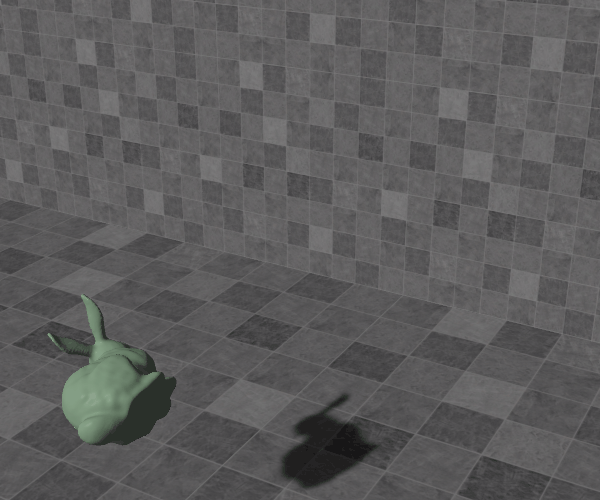
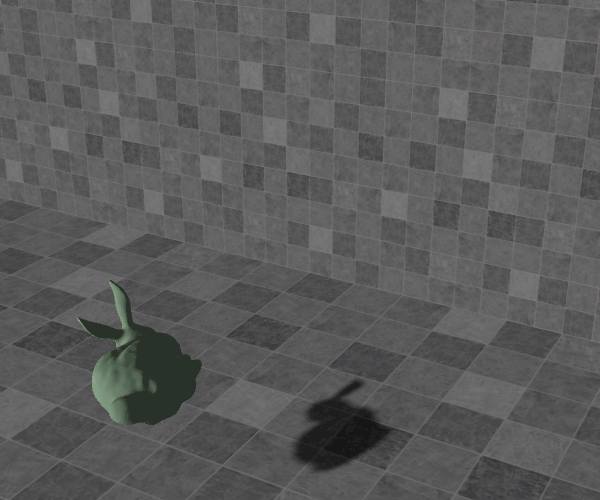
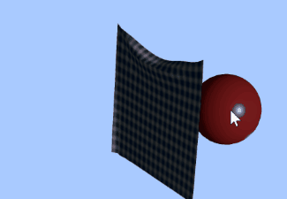
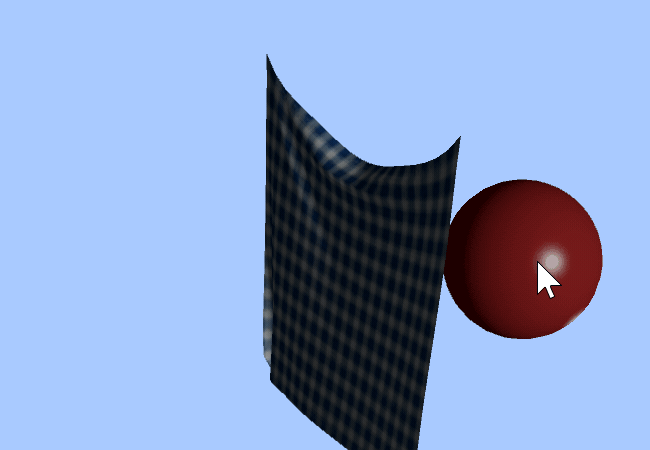

# Physically-based Animation

## 1 Rigid Body Dynamics

| leapfrog integration                             | shape matching                                        |
| ------------------------------------------------ | ----------------------------------------------------- |
|  |  |

## 2 Cloth Simulation

simulated clothes as a spring system:

| implicit solver                                    | position-based dynamics (more stiff)     |
| -------------------------------------------------- | ---------------------------------------- |
|  |  |
