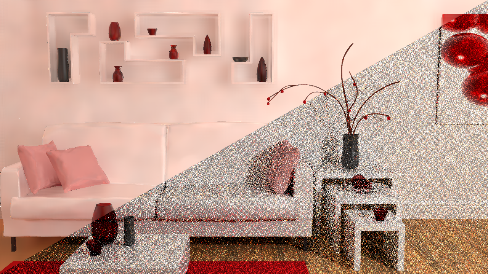
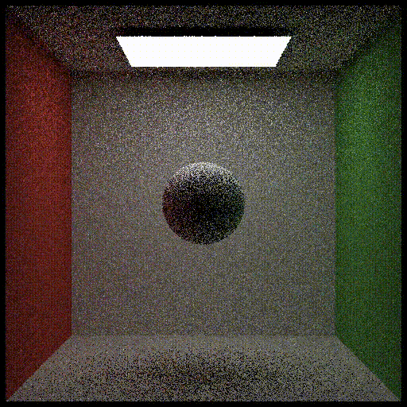
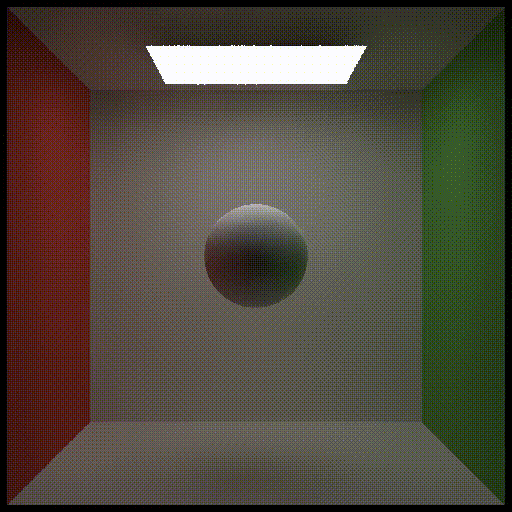

# Real-time High Quality Rendering

## 5 Denoising in Real-time Ray Tracing

Implemented spatio-temporal filtering techniques widely used in RTRT

- Spatial denoising: joint bilateral filtering with growing kernel size (À-Trous Wavelet)
- Temporal denoising: projection by motion vectors

| Raw                              s   | Denoised                                 |
| ----------------------------------- | ---------------------------------------- |
|  |  |
