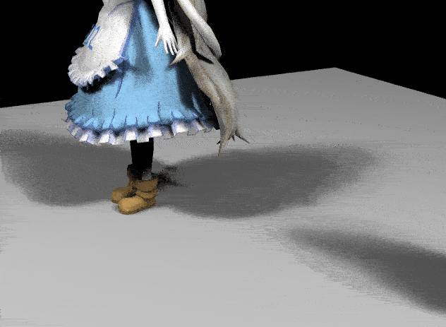
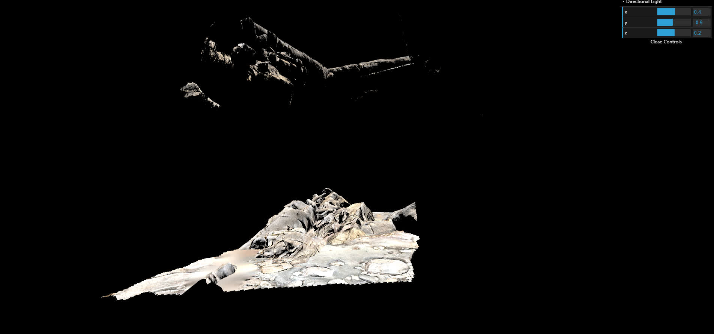
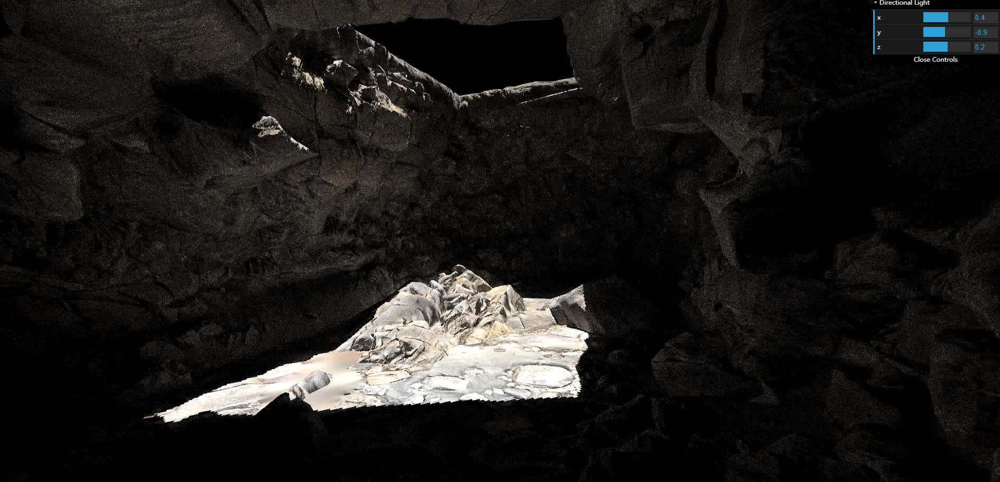
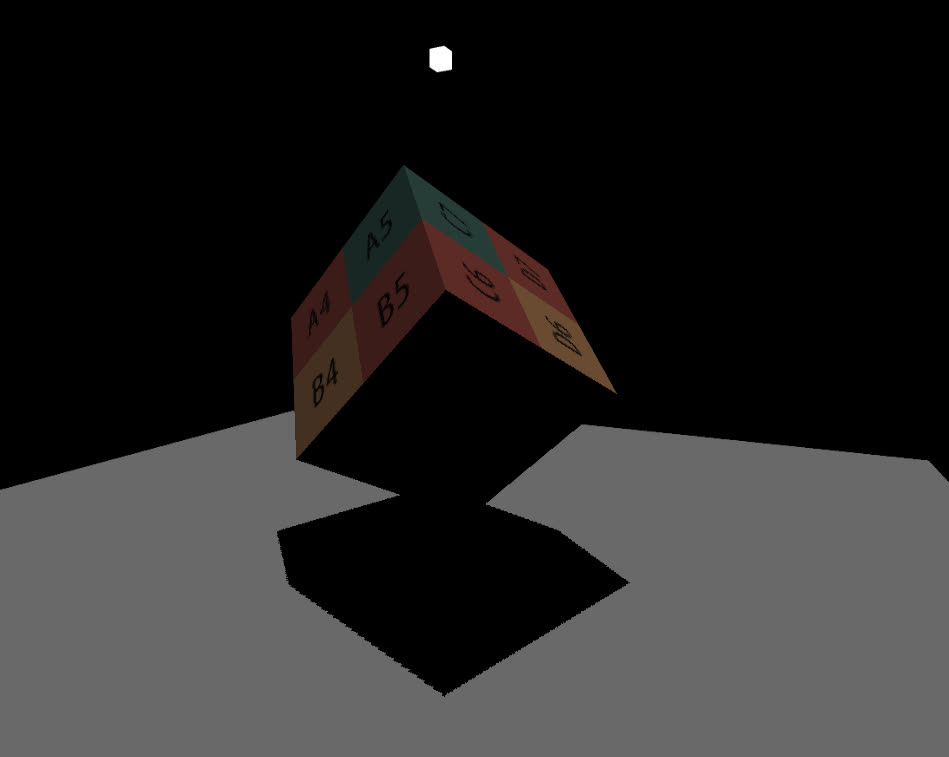
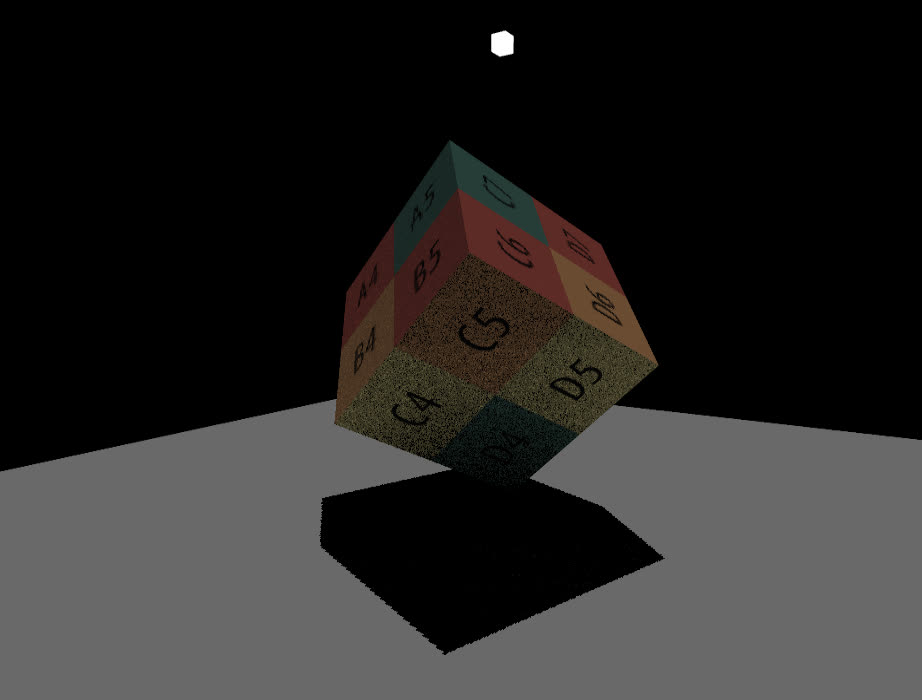
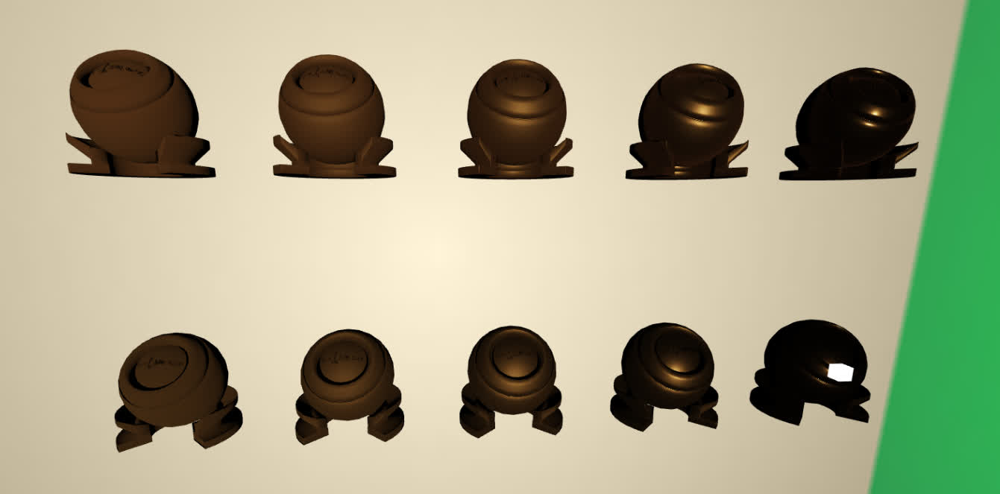
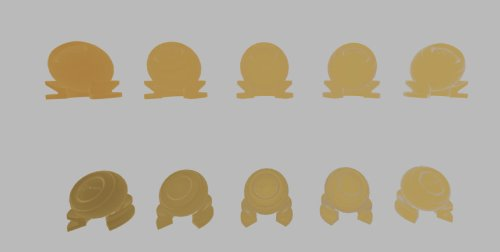
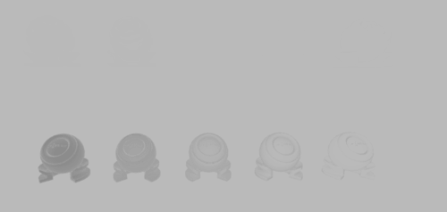
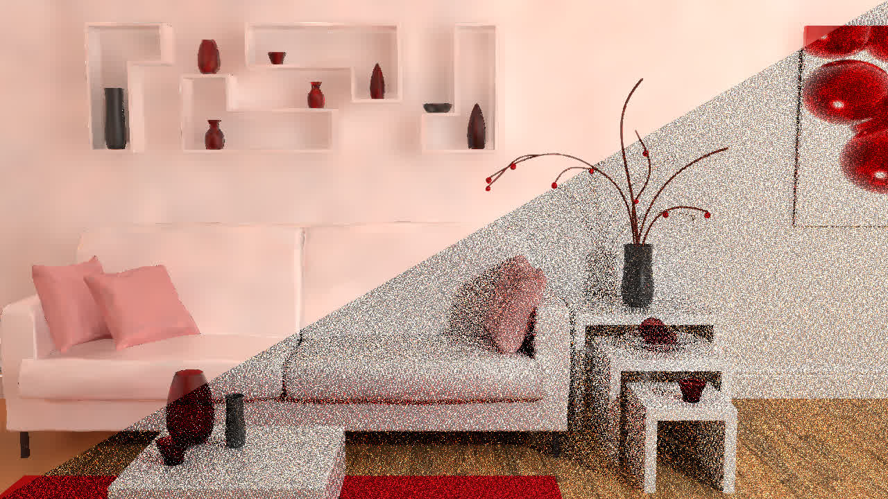

# Real-time High Quality Rendering

## 1 Real-time Shadows (PCF and PCSS)

Rendered percentage closer soft shadows:

## 2 Precomputed Radiance Transfer

Implemented Precomputed Radiance Transfer (PRT), which basically pre-computes both lighting and light transport approximated by spherical harmonics, and reproduces global illumination in real-time.

You can notice that the red/green/white walls of the rotating cornell box alternate to illuminate our Mary maid model, with decent inter-reflections between hair, clothes, and body.

## 3 Screen Space Ray Tracing

Obtained two-bounce global illumination by screen space ray tracing (accelerated with Mipmap depth maps)

| only direct lighting                        | + indirect lighting                          |
| ------------------------------------------- | -------------------------------------------- |
|   |  |
|  |    |

## 4 The Kulla-Conty Microfacet BRDF

Implemented the Kulla-Conty approximation on energy-preserving for the microfacet BRDF.

References:

- Christopher Kulla and Alejandro Conty, [Revisiting Physically Based Shading at Imageworks](https://fpsunflower.github.io/ckulla/data/s2017_pbs_imageworks_slides_v2.pdf), SIGGRAPH 2017 course
- Walter et al., [Microfacet Models for Refraction through Rough Surfaces](https://www.graphics.cornell.edu/~bjw/microfacetbsdf.pdf), EGSR 2007

This figure shows the energy compensation by the KC approximation.

The roughness decreases from left to right. The first row is a bit brighter than the second row which does not have compensation.

There is also a White Furnace Test for fun :)

| F_0=Gold                        | F_0=White (no energy absorption, so *invisible* matpreview balls!) |
| --------------------------------- | -------------------------------------------------------------------- |
|  |                         |

## 5 Denoising in Real-time Ray Tracing

Implemented spatio-temporal filtering techniques widely used in RTRT

- Spatial denoising: joint bilateral filtering with growing kernel size (À-Trous Wavelet)
- Temporal denoising: projection by motion vectors

| Raw                                 | Denoised                                 |
| ----------------------------------- | ---------------------------------------- |
|  |  |
