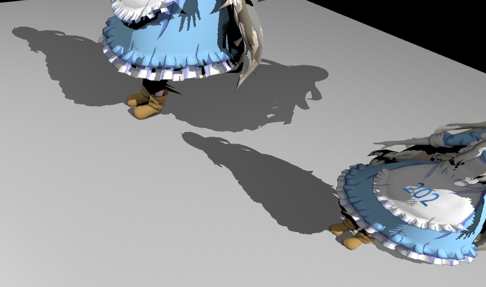
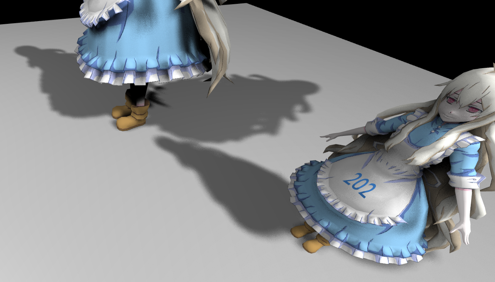
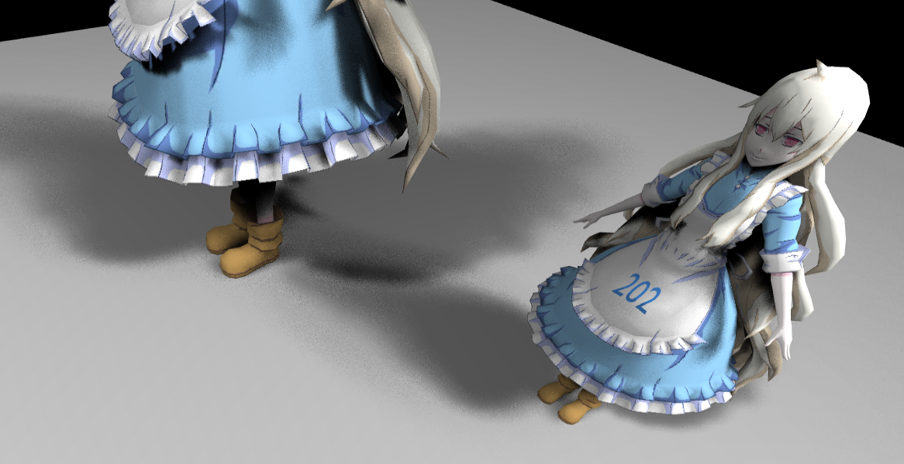

# GAMES202 homework 1

## Hard shadows with shadow maps

## Soft shadows with Percentage Closer Filter (PCF)

## Soft shadows with Percentage Closer Soft Shadow (PCSS)

## Bonus (multiple lights & moving objects)

