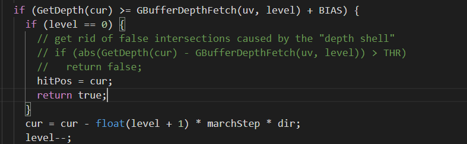

# GAMES202 homework 3

完成了基础部分和bonus部分

bonus部分涉及修改的代码如下：

- engine.js新加了两个全局变量quadVBO和mipmapShader，并在main函数里初始化他们，用于mipmap生成
- FBO.js里，在构造函数中配置了用于生成mipmap相关的fbo、texture等
- SSRMaterial.js，修改了相应的uniform变量，用于传入mipmap
- webGLRenderer.js，在buffer pass之后camera pass之前新增一段用于生成mipmap的pass

关于images里面的说明：

1.0和2.0的区别是是否开启下段代码(ssrFragment.glsl)：

