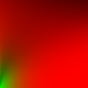
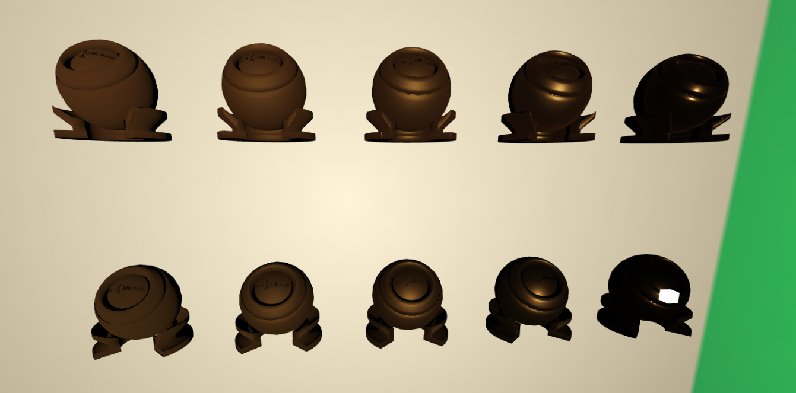

# GAMES 202 Homework 4 

## 已完成的内容

- 全部基础内容
- 两个提高项
- [额外] White Furnace Test
- [额外] 切换金属颜色(r, g数据来自[Conductor Fresnel - Gulbrandsen, 2014])

## 完成的代码部分 & 结果图

### 预计算E(u)

- 补全了相关函数
- 在Integrate@Emu_MC.cpp中完成了基础内容
- 在IntegrateBRDF@Emu_IS.cpp中完成了两个提高项
  - splitsum得到的结果存在r、g通道
  - GGX重要性采样得到的结果存在b通道


Emu基础结果：


Emu使用GGX重要性采样得到的结果：


splitsum的结果：



最终使用的预计算图：


### 预计算E_avg

- 实现全在Eavg_IS.cpp中，没有修改Eavg_MC.cpp
- 主要涉及的代码如下

```cpp
for (int i = 0; i < resolution; i++) {
            float roughness = step * (static_cast<float>(i) + 0.5f);
            for (int j = 0; j < resolution; j++) {
                float NdotV = step * (static_cast<float>(j) + 0.5f);
                Vec3f V = Vec3f(std::sqrt(1.f - NdotV * NdotV), 0.f, NdotV);

                Vec3f Emu = getEmu((resolution - 1 - i), j, Edata);
                Eavg += Vec3f(Emu.z) * 2 * NdotV * step;
            }

            for (int k = 0; k < resolution; k++) {
                setRGB(i, k, Eavg, data);
            }

            Eavg = Vec3f(0.0);
        }
```

Eavg结果：


### 在实时渲染框架里实现Kulla-Conty

- 补全了KullaContyFragment.glsl和PBRFragment.glsl的相关函数

结果：



### White Furnace Test & 颜色切换

- 在engine.js里加了相关全局变量
  - **engine.js:20，wft变量开关White Furnace Test**
  - **engine.js:22-38，选取颜色**
- 分别在KullaContyMaterial.js和PBRMaterial.js中给shader传入相关参数
- 在KullaContyFragment.glsl和PBRFragment.glsl中实现了White Furnace Test的相关代码
  - 通过预计算的BRDF_LUT得到底色
  - 重要性采样积分Fms得到补充的能量

White Furnace Test (F0 = {1.0, 1.0, 1.0}，即没有能量吸收)【images文件夹下附有gif，能看得更清楚】：

.png)

White Furnace Test (F0 = Copper)：

.png)

White Furnace Test (F0 = Gold)：

.png)